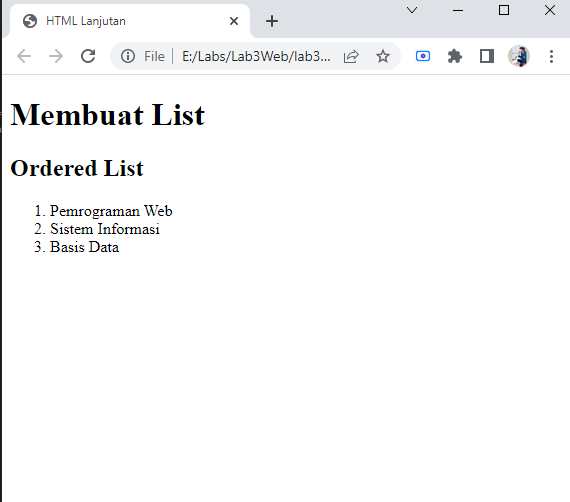
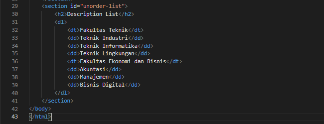
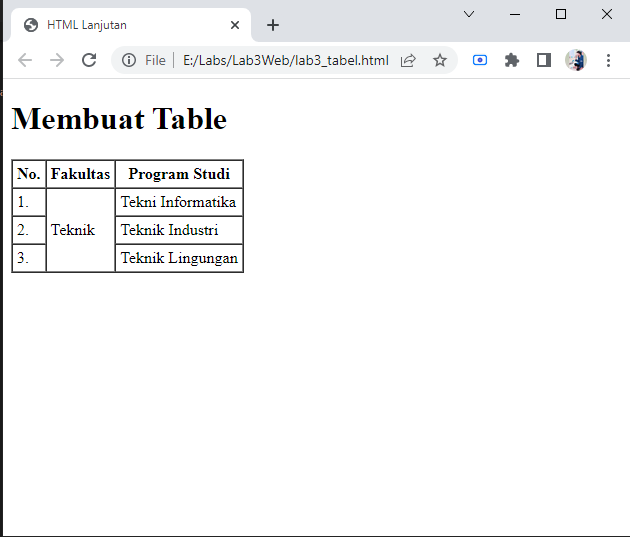

# Lab3Web
## Belajar Membuat List

### Ordered List

Langkah pertama membuat dokumen HTML, kemudian untuk kode tag yang digunakan
untuk membuat Ordered List adalah `<ol>`, Berikut contoh codingan nya :

Tampilan di Website akan seperti ini :

### Unorder List

Kemudian tambahkan kode untuk Unorder List dengan kode tag `<ul>`, setelah deklarasi
ordered list pada Section unorder-list, seperti berikut ini :

Tampilan di Website akan seperti ini :

### Description List 

Untuk menambahkan Description List yaitu dengan Kode tag `<dl>`, Contohnya seperti gambar dibawah ini :

dan untuk tampilan Website nya jadi seperti ini :

### Belajar Membuat Tabel

Membuat File baru kemudian membuat table dengan Kode-kode sebagai berikut :

- `<table>` : Mendefinisikan sebuah tabel dalam dokumen HTML. Atribut : border, cellpadding, cellspacing.
- `<thead>` : untuk membungkus bagian kepala tabel 
- `<tbody>` : untuk membungkus bagian body tabel
- `<th>`    : Membuat judul kolom
- `<tr>`    : Mendefinisikan baris dalam tabel 
- `<td>`    : Mendefinisikan kolom tabel

Untuk mengatur margin dan padding cel data, tambahkan atribut cellpadding dan cellspacing pada tag table.
Untuk contoh codingan nya sebagai berikut :

Tampilan Website nya akan seperti ini :

### Menggabungkan Cell Data

Untuk menggabungkan cel data, gunakan atribut rowspan dan colspan. Atribut rowspan untuk menggabungkan baris (secara vertikal) 
dan colspan untuk menggabungkan kolom (secara horizontal). Contohnya sebagai berikut :

Tampilan Website nya seperti ini :

